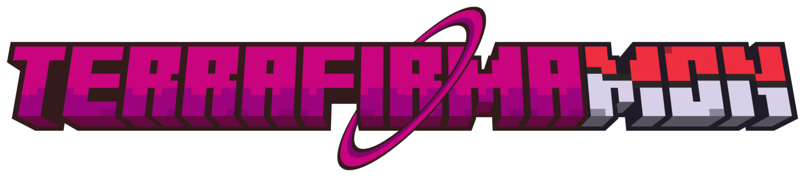

<p align="center">
  
</p>

<p align="center">
  <b>TerraFirmaCraft and GregTech, with Pokémon living in it.</b><br>
  Minecraft 1.20.1 &middot; Forge 47.4.13 &middot; 270 mods
</p>

---

## What this is

TerraFirmaMon puts [Cobblemon](https://cobblemon.com/) inside
[TerraFirmaGreg-Modern](https://github.com/TerraFirmaGreg-Team/Modpack-Modern) — the
TerraFirmaCraft-plus-GregTech pack where you start by knapping rocks and end up running chemical
plants — and then does the work to make the two actually belong together rather than merely
coexist.

That work is most of what lives in this repository:

- **Poké Balls are made, not found.** Every ball, rod, TM and medicine is rebuilt onto TFC's
  knapping, forging and firing chains and GregTech's machines, tiered from primitive clay
  through to assembler lines. Anything with no path to it is hidden from the recipe viewer on
  purpose, rather than sitting there uncraftable.
- **Cobblemon's wood is TFC wood.** Apricorn logs go through TFC's sawing, fuel and support
  chains, are axe- and sharp-tool-mineable where TFC expects, and fell properly.
- **Berries and apricorns are TFC food.** They rot, they compost, they feed TFC's juicing and
  preservation chains.
- **Spawning follows the world.** Pokémon spawn against TFC's climate, not vanilla biome
  assumptions.
- **Pokémon pull carts.** A rideable Pokémon can be hitched to a TFC Astikor cart, plow or
  wagon. Fliers stay on the ground while harnessed, and the load sits far enough back not to
  clip the animal pulling it.

## Installing

The pack keeps itself up to date through [packwiz](https://packwiz.infra.link/). You set it up
once and every launch afterwards syncs whatever changed.

1. Install [Prism Launcher](https://prismlauncher.org/) and create a **Minecraft 1.20.1 /
   Forge 47.4.13** instance.
2. Drop [`packwiz-installer-bootstrap.jar`](https://github.com/packwiz/packwiz-installer-bootstrap/releases)
   into the instance's `.minecraft` folder.
3. Instance → **Edit** → **Settings** → **Custom commands**, tick *Custom commands*, and set the
   **Pre-launch command** to:

   ```
   "$INST_JAVA" -jar packwiz-installer-bootstrap.jar https://raw.githubusercontent.com/n0es/terrafirmamon/main/pack.toml
   ```

4. Give the instance about 8 GB of RAM and launch. The first run downloads the whole pack; after
   that it only fetches what changed.

Updating is just launching the game. There is no mod to install and nothing to re-download by
hand.

## What is in this repository

Configs, KubeJS scripts, resource packs and the packwiz index — everything that makes this pack
*this* pack.

**Mod jars are deliberately not here.** `mods/` holds one small `.pw.toml` per mod naming a
download URL and a hash, and the installer fetches each one from its author's own distribution.
Re-hosting other people's mods is not ours to do, and the metadata approach keeps this repo at a
few hundred megabytes instead of a gigabyte.

The two jars published on this repo's releases are the only ones that are ours to give away:

| Jar | What it is | Licence |
|---|---|---|
| `Cobblemon-forge-1.8.0+1.20.1.jar` | Cobblemon 1.8.0 backported from 1.21.1 to 1.20.1, so the current Cobblemon can run on the version TerraFirmaGreg targets | MPL-2.0, as Cobblemon |
| `snsfix-1.0.2.jar` | A small mixin fixing Sacks 'N Such containers losing their contents in creative | MIT |

## Releasing an update

The pack carries a version number, shown under the logo on the main menu. It lives in exactly two
files and they must not drift, so bump them together:

```
python scripts/bump_version.py            # 1.2.1 -> 1.2.2
python scripts/bump_version.py minor      # 1.2.1 -> 1.3.0
python scripts/bump_version.py 2.0.0      # explicit
```

That rewrites `pack.toml`, writes `config/fancymenu/assets/version.txt`, and refreshes the index
hashes. Commit those three files with the change they describe and merge to `main`.

Nothing else is needed: `version.txt` is a normal pack file, so the same packwiz sync that
installs the update also updates what the menu reads, on clients and on the server.

## Credits

This pack is other people's work with some glue on top. In particular:

- **[TerraFirmaGreg-Team](https://github.com/TerraFirmaGreg-Team/Modpack-Modern)** — for
  TerraFirmaGreg-Modern, the pack this is built on top of, and for the enormous body of
  integration between TFC and GregTech that made adding a third pillar plausible at all.
  Modpack licensed LGPL-3.0.
- **[The Cobblemon Team](https://cobblemon.com/)** — for Cobblemon, and for releasing it under
  MPL-2.0, which is the only reason the 1.20.1 backport in this pack can exist or be shared.
  Source: [gitlab.com/cable-mc/cobblemon](https://gitlab.com/cable-mc/cobblemon).
- **[AlcatrazEscapee and the TerraFirmaCraft team](https://github.com/TerraFirmaCraft/TerraFirmaCraft)**
  — for TerraFirmaCraft (EUPL-1.2).
- **[GregTechCEu](https://github.com/GregTechCEu/GregTech-Modern)** — for GregTech Modern
  (LGPL-3.0).
- **EERussianguy and the FirmaLife team** — for FirmaLife and much of the TFC addon ecosystem
  this pack leans on (MIT).
- **Every author of the other 260-odd mods here.** Their licences are their own and none of
  their work is redistributed by this repository; the installer always fetches from the source
  they publish to. `mods/*.pw.toml` names each one.

If you are one of those authors and would rather not be included, open an issue and it comes out.

## Licence

The pack's own content in this repository — KubeJS scripts, configs, recipes and documentation —
is LGPL-3.0, matching TerraFirmaGreg-Modern, which much of it is derived from.

This does not extend to the mods the pack depends on, which remain under their own licences, nor
to the two jars on the releases page, which carry the licences listed above.
